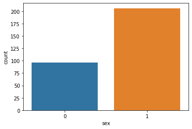

# Heart-Attack-Prediction
Training and visualizing data of heart attack patients 


### Heart Attack Prediction

<p>Rafay Mahmood</p>
<p>L1F18BSCS0095</p>

#### Basically, our main goal is to predict heart attack or stroke based on vitals of a patient. Our dataset consists of vitals of various patients along with their general information like age, gender etc. Based on reports and vitals we will predict either this patient had attack or not


```python
import re
import pandas as pd 
import numpy as np 
import matplotlib.pyplot as plt 
import seaborn as sns
import string
import warnings 
import math
warnings.filterwarnings("ignore", category=DeprecationWarning)

%matplotlib inline
```


```python
#reading csv files.

hdf = pd.read_csv('heart.csv')
o2 = pd.read_csv('o2Saturation.csv')
```


```python
#concating both dataset files
df = pd.concat([hdf, o2], axis=1, join='inner')
df.head()
```


<div>
<style scoped>
    .dataframe tbody tr th:only-of-type {
        vertical-align: middle;
    }

    .dataframe tbody tr th {
        vertical-align: top;
    }

    .dataframe thead th {
        text-align: right;
    }
</style>
<table border="1" class="dataframe">
  <thead>
    <tr style="text-align: right;">
      <th></th>
      <th>age</th>
      <th>sex</th>
      <th>cp</th>
      <th>trtbps</th>
      <th>chol</th>
      <th>fbs</th>
      <th>restecg</th>
      <th>thalachh</th>
      <th>exng</th>
      <th>oldpeak</th>
      <th>slp</th>
      <th>caa</th>
      <th>thall</th>
      <th>output</th>
      <th>98.6</th>
    </tr>
  </thead>
  <tbody>
    <tr>
      <th>0</th>
      <td>63</td>
      <td>1</td>
      <td>3</td>
      <td>145</td>
      <td>233</td>
      <td>1</td>
      <td>0</td>
      <td>150</td>
      <td>0</td>
      <td>2.3</td>
      <td>0</td>
      <td>0</td>
      <td>1</td>
      <td>1</td>
      <td>98.6</td>
    </tr>
    <tr>
      <th>1</th>
      <td>37</td>
      <td>1</td>
      <td>2</td>
      <td>130</td>
      <td>250</td>
      <td>0</td>
      <td>1</td>
      <td>187</td>
      <td>0</td>
      <td>3.5</td>
      <td>0</td>
      <td>0</td>
      <td>2</td>
      <td>1</td>
      <td>98.6</td>
    </tr>
    <tr>
      <th>2</th>
      <td>41</td>
      <td>0</td>
      <td>1</td>
      <td>130</td>
      <td>204</td>
      <td>0</td>
      <td>0</td>
      <td>172</td>
      <td>0</td>
      <td>1.4</td>
      <td>2</td>
      <td>0</td>
      <td>2</td>
      <td>1</td>
      <td>98.6</td>
    </tr>
    <tr>
      <th>3</th>
      <td>56</td>
      <td>1</td>
      <td>1</td>
      <td>120</td>
      <td>236</td>
      <td>0</td>
      <td>1</td>
      <td>178</td>
      <td>0</td>
      <td>0.8</td>
      <td>2</td>
      <td>0</td>
      <td>2</td>
      <td>1</td>
      <td>98.1</td>
    </tr>
    <tr>
      <th>4</th>
      <td>57</td>
      <td>0</td>
      <td>0</td>
      <td>120</td>
      <td>354</td>
      <td>0</td>
      <td>1</td>
      <td>163</td>
      <td>1</td>
      <td>0.6</td>
      <td>2</td>
      <td>0</td>
      <td>2</td>
      <td>1</td>
      <td>97.5</td>
    </tr>
  </tbody>
</table>
</div>


```python
#renaming saturation column to o2
df.rename(columns={'98.6':'o2'} ,inplace = True)
df
```


<div>
<style scoped>
    .dataframe tbody tr th:only-of-type {
        vertical-align: middle;
    }

    .dataframe tbody tr th {
        vertical-align: top;
    }

    .dataframe thead th {
        text-align: right;
    }
</style>
<table border="1" class="dataframe">
  <thead>
    <tr style="text-align: right;">
      <th></th>
      <th>age</th>
      <th>sex</th>
      <th>cp</th>
      <th>trtbps</th>
      <th>chol</th>
      <th>fbs</th>
      <th>restecg</th>
      <th>thalachh</th>
      <th>exng</th>
      <th>oldpeak</th>
      <th>slp</th>
      <th>caa</th>
      <th>thall</th>
      <th>output</th>
      <th>o2</th>
    </tr>
  </thead>
  <tbody>
    <tr>
      <th>0</th>
      <td>63</td>
      <td>1</td>
      <td>3</td>
      <td>145</td>
      <td>233</td>
      <td>1</td>
      <td>0</td>
      <td>150</td>
      <td>0</td>
      <td>2.3</td>
      <td>0</td>
      <td>0</td>
      <td>1</td>
      <td>1</td>
      <td>98.6</td>
    </tr>
    <tr>
      <th>1</th>
      <td>37</td>
      <td>1</td>
      <td>2</td>
      <td>130</td>
      <td>250</td>
      <td>0</td>
      <td>1</td>
      <td>187</td>
      <td>0</td>
      <td>3.5</td>
      <td>0</td>
      <td>0</td>
      <td>2</td>
      <td>1</td>
      <td>98.6</td>
    </tr>
    <tr>
      <th>2</th>
      <td>41</td>
      <td>0</td>
      <td>1</td>
      <td>130</td>
      <td>204</td>
      <td>0</td>
      <td>0</td>
      <td>172</td>
      <td>0</td>
      <td>1.4</td>
      <td>2</td>
      <td>0</td>
      <td>2</td>
      <td>1</td>
      <td>98.6</td>
    </tr>
    <tr>
      <th>3</th>
      <td>56</td>
      <td>1</td>
      <td>1</td>
      <td>120</td>
      <td>236</td>
      <td>0</td>
      <td>1</td>
      <td>178</td>
      <td>0</td>
      <td>0.8</td>
      <td>2</td>
      <td>0</td>
      <td>2</td>
      <td>1</td>
      <td>98.1</td>
    </tr>
    <tr>
      <th>4</th>
      <td>57</td>
      <td>0</td>
      <td>0</td>
      <td>120</td>
      <td>354</td>
      <td>0</td>
      <td>1</td>
      <td>163</td>
      <td>1</td>
      <td>0.6</td>
      <td>2</td>
      <td>0</td>
      <td>2</td>
      <td>1</td>
      <td>97.5</td>
    </tr>
    <tr>
      <th>...</th>
      <td>...</td>
      <td>...</td>
      <td>...</td>
      <td>...</td>
      <td>...</td>
      <td>...</td>
      <td>...</td>
      <td>...</td>
      <td>...</td>
      <td>...</td>
      <td>...</td>
      <td>...</td>
      <td>...</td>
      <td>...</td>
      <td>...</td>
    </tr>
    <tr>
      <th>298</th>
      <td>57</td>
      <td>0</td>
      <td>0</td>
      <td>140</td>
      <td>241</td>
      <td>0</td>
      <td>1</td>
      <td>123</td>
      <td>1</td>
      <td>0.2</td>
      <td>1</td>
      <td>0</td>
      <td>3</td>
      <td>0</td>
      <td>97.5</td>
    </tr>
    <tr>
      <th>299</th>
      <td>45</td>
      <td>1</td>
      <td>3</td>
      <td>110</td>
      <td>264</td>
      <td>0</td>
      <td>1</td>
      <td>132</td>
      <td>0</td>
      <td>1.2</td>
      <td>1</td>
      <td>0</td>
      <td>3</td>
      <td>0</td>
      <td>97.5</td>
    </tr>
    <tr>
      <th>300</th>
      <td>68</td>
      <td>1</td>
      <td>0</td>
      <td>144</td>
      <td>193</td>
      <td>1</td>
      <td>1</td>
      <td>141</td>
      <td>0</td>
      <td>3.4</td>
      <td>1</td>
      <td>2</td>
      <td>3</td>
      <td>0</td>
      <td>97.5</td>
    </tr>
    <tr>
      <th>301</th>
      <td>57</td>
      <td>1</td>
      <td>0</td>
      <td>130</td>
      <td>131</td>
      <td>0</td>
      <td>1</td>
      <td>115</td>
      <td>1</td>
      <td>1.2</td>
      <td>1</td>
      <td>1</td>
      <td>3</td>
      <td>0</td>
      <td>97.5</td>
    </tr>
    <tr>
      <th>302</th>
      <td>57</td>
      <td>0</td>
      <td>1</td>
      <td>130</td>
      <td>236</td>
      <td>0</td>
      <td>0</td>
      <td>174</td>
      <td>0</td>
      <td>0.0</td>
      <td>1</td>
      <td>1</td>
      <td>2</td>
      <td>0</td>
      <td>97.5</td>
    </tr>
  </tbody>
</table>
<p>303 rows × 15 columns</p>
</div>


```python
df[df.duplicated(keep = False)]
```


<div>
<style scoped>
    .dataframe tbody tr th:only-of-type {
        vertical-align: middle;
    }

    .dataframe tbody tr th {
        vertical-align: top;
    }

    .dataframe thead th {
        text-align: right;
    }
</style>
<table border="1" class="dataframe">
  <thead>
    <tr style="text-align: right;">
      <th></th>
      <th>age</th>
      <th>sex</th>
      <th>cp</th>
      <th>trtbps</th>
      <th>chol</th>
      <th>fbs</th>
      <th>restecg</th>
      <th>thalachh</th>
      <th>exng</th>
      <th>oldpeak</th>
      <th>slp</th>
      <th>caa</th>
      <th>thall</th>
      <th>output</th>
      <th>o2</th>
    </tr>
  </thead>
  <tbody>
    <tr>
      <th>163</th>
      <td>38</td>
      <td>1</td>
      <td>2</td>
      <td>138</td>
      <td>175</td>
      <td>0</td>
      <td>1</td>
      <td>173</td>
      <td>0</td>
      <td>0.0</td>
      <td>2</td>
      <td>4</td>
      <td>2</td>
      <td>1</td>
      <td>97.5</td>
    </tr>
    <tr>
      <th>164</th>
      <td>38</td>
      <td>1</td>
      <td>2</td>
      <td>138</td>
      <td>175</td>
      <td>0</td>
      <td>1</td>
      <td>173</td>
      <td>0</td>
      <td>0.0</td>
      <td>2</td>
      <td>4</td>
      <td>2</td>
      <td>1</td>
      <td>97.5</td>
    </tr>
  </tbody>
</table>
</div>


```python
df.drop_duplicates(keep = 'first', inplace = True)
```


```python
df.describe()
```


<div>
<style scoped>
    .dataframe tbody tr th:only-of-type {
        vertical-align: middle;
    }

    .dataframe tbody tr th {
        vertical-align: top;
    }

    .dataframe thead th {
        text-align: right;
    }
</style>
<table border="1" class="dataframe">
  <thead>
    <tr style="text-align: right;">
      <th></th>
      <th>age</th>
      <th>sex</th>
      <th>cp</th>
      <th>trtbps</th>
      <th>chol</th>
      <th>fbs</th>
      <th>restecg</th>
      <th>thalachh</th>
      <th>exng</th>
      <th>oldpeak</th>
      <th>slp</th>
      <th>caa</th>
      <th>thall</th>
      <th>output</th>
      <th>o2</th>
    </tr>
  </thead>
  <tbody>
    <tr>
      <th>count</th>
      <td>302.00000</td>
      <td>302.000000</td>
      <td>302.000000</td>
      <td>302.000000</td>
      <td>302.000000</td>
      <td>302.000000</td>
      <td>302.000000</td>
      <td>302.000000</td>
      <td>302.000000</td>
      <td>302.000000</td>
      <td>302.000000</td>
      <td>302.000000</td>
      <td>302.000000</td>
      <td>302.000000</td>
      <td>302.000000</td>
    </tr>
    <tr>
      <th>mean</th>
      <td>54.42053</td>
      <td>0.682119</td>
      <td>0.963576</td>
      <td>131.602649</td>
      <td>246.500000</td>
      <td>0.149007</td>
      <td>0.526490</td>
      <td>149.569536</td>
      <td>0.327815</td>
      <td>1.043046</td>
      <td>1.397351</td>
      <td>0.718543</td>
      <td>2.314570</td>
      <td>0.543046</td>
      <td>97.480795</td>
    </tr>
    <tr>
      <th>std</th>
      <td>9.04797</td>
      <td>0.466426</td>
      <td>1.032044</td>
      <td>17.563394</td>
      <td>51.753489</td>
      <td>0.356686</td>
      <td>0.526027</td>
      <td>22.903527</td>
      <td>0.470196</td>
      <td>1.161452</td>
      <td>0.616274</td>
      <td>1.006748</td>
      <td>0.613026</td>
      <td>0.498970</td>
      <td>0.347313</td>
    </tr>
    <tr>
      <th>min</th>
      <td>29.00000</td>
      <td>0.000000</td>
      <td>0.000000</td>
      <td>94.000000</td>
      <td>126.000000</td>
      <td>0.000000</td>
      <td>0.000000</td>
      <td>71.000000</td>
      <td>0.000000</td>
      <td>0.000000</td>
      <td>0.000000</td>
      <td>0.000000</td>
      <td>0.000000</td>
      <td>0.000000</td>
      <td>96.500000</td>
    </tr>
    <tr>
      <th>25%</th>
      <td>48.00000</td>
      <td>0.000000</td>
      <td>0.000000</td>
      <td>120.000000</td>
      <td>211.000000</td>
      <td>0.000000</td>
      <td>0.000000</td>
      <td>133.250000</td>
      <td>0.000000</td>
      <td>0.000000</td>
      <td>1.000000</td>
      <td>0.000000</td>
      <td>2.000000</td>
      <td>0.000000</td>
      <td>97.500000</td>
    </tr>
    <tr>
      <th>50%</th>
      <td>55.50000</td>
      <td>1.000000</td>
      <td>1.000000</td>
      <td>130.000000</td>
      <td>240.500000</td>
      <td>0.000000</td>
      <td>1.000000</td>
      <td>152.500000</td>
      <td>0.000000</td>
      <td>0.800000</td>
      <td>1.000000</td>
      <td>0.000000</td>
      <td>2.000000</td>
      <td>1.000000</td>
      <td>97.500000</td>
    </tr>
    <tr>
      <th>75%</th>
      <td>61.00000</td>
      <td>1.000000</td>
      <td>2.000000</td>
      <td>140.000000</td>
      <td>274.750000</td>
      <td>0.000000</td>
      <td>1.000000</td>
      <td>166.000000</td>
      <td>1.000000</td>
      <td>1.600000</td>
      <td>2.000000</td>
      <td>1.000000</td>
      <td>3.000000</td>
      <td>1.000000</td>
      <td>97.500000</td>
    </tr>
    <tr>
      <th>max</th>
      <td>77.00000</td>
      <td>1.000000</td>
      <td>3.000000</td>
      <td>200.000000</td>
      <td>564.000000</td>
      <td>1.000000</td>
      <td>2.000000</td>
      <td>202.000000</td>
      <td>1.000000</td>
      <td>6.200000</td>
      <td>2.000000</td>
      <td>4.000000</td>
      <td>3.000000</td>
      <td>1.000000</td>
      <td>98.600000</td>
    </tr>
  </tbody>
</table>
</div>


```python
df.info()
```

    <class 'pandas.core.frame.DataFrame'>
    Int64Index: 302 entries, 0 to 302
    Data columns (total 15 columns):
     #   Column    Non-Null Count  Dtype  
    ---  ------    --------------  -----  
     0   age       302 non-null    int64  
     1   sex       302 non-null    int64  
     2   cp        302 non-null    int64  
     3   trtbps    302 non-null    int64  
     4   chol      302 non-null    int64  
     5   fbs       302 non-null    int64  
     6   restecg   302 non-null    int64  
     7   thalachh  302 non-null    int64  
     8   exng      302 non-null    int64  
     9   oldpeak   302 non-null    float64
     10  slp       302 non-null    int64  
     11  caa       302 non-null    int64  
     12  thall     302 non-null    int64  
     13  output    302 non-null    int64  
     14  o2        302 non-null    float64
    dtypes: float64(2), int64(13)
    memory usage: 37.8 KB


```python
df.shape
```


    (302, 15)


- age: age of the patient
- sex: 1 = male, 0 = female (binary)
- cp: chest pain type (4 values) Value 0: typical angina, Value 1: atypical angina, Value 2: non-anginal pain, Value 3: asymptomatic
- trestbps: resting blood pressure
- chol: serum cholesterol in mg/dl
- fbs: fasting blood sugar > 120 mg/dl (binary) (1 = true; 0 = false)
- restecg: resting electrocardiography results (values 0, 1, 2)
- thalachh: maximum heart rate achieved
- exng: exercise induced angina (binary) (1 = yes, 0 = no)
- oldpeak: = ST depression induced by exercise relative to rest
- slp: of the peak exercise ST segment (Value 0: up sloping , Value 1: flat , Value 2: down sloping )
- caa: number of major vessels (values: 0–3)
- thall: maximum heart rate achieved (0 = no-data, 1 = normal, 2 = fixed defect, 3 = reversible defect)


```python
#displaying count display categorized according to gender
sns.countplot(x = df['sex'])
```


    <AxesSubplot:xlabel='sex', ylabel='count'>


    

    


## Blood Pressure

<p>Picture shows the range of blood pressure. Systolic mmHg if higher then 139 is considered to be High and if higher then 140 it is stage 2 of Hypertension</p>
<p>Let's set our Systolic limit to 139. We will consider patient in danger if having upper number higher then 139 mm Hg</p>


## Cholestrol Levels

<p>Picture shows the upper limit of cholestrol of 240. We will consider cholestrol higher then 239 as in danger number of cholestrol </p>


```python
df.describe().transpose()
```


<div>
<style scoped>
    .dataframe tbody tr th:only-of-type {
        vertical-align: middle;
    }

    .dataframe tbody tr th {
        vertical-align: top;
    }

    .dataframe thead th {
        text-align: right;
    }
</style>
<table border="1" class="dataframe">
  <thead>
    <tr style="text-align: right;">
      <th></th>
      <th>count</th>
      <th>mean</th>
      <th>std</th>
      <th>min</th>
      <th>25%</th>
      <th>50%</th>
      <th>75%</th>
      <th>max</th>
    </tr>
  </thead>
  <tbody>
    <tr>
      <th>age</th>
      <td>302.0</td>
      <td>54.420530</td>
      <td>9.047970</td>
      <td>29.0</td>
      <td>48.00</td>
      <td>55.5</td>
      <td>61.00</td>
      <td>77.0</td>
    </tr>
    <tr>
      <th>sex</th>
      <td>302.0</td>
      <td>0.682119</td>
      <td>0.466426</td>
      <td>0.0</td>
      <td>0.00</td>
      <td>1.0</td>
      <td>1.00</td>
      <td>1.0</td>
    </tr>
    <tr>
      <th>cp</th>
      <td>302.0</td>
      <td>0.963576</td>
      <td>1.032044</td>
      <td>0.0</td>
      <td>0.00</td>
      <td>1.0</td>
      <td>2.00</td>
      <td>3.0</td>
    </tr>
    <tr>
      <th>trtbps</th>
      <td>302.0</td>
      <td>131.602649</td>
      <td>17.563394</td>
      <td>94.0</td>
      <td>120.00</td>
      <td>130.0</td>
      <td>140.00</td>
      <td>200.0</td>
    </tr>
    <tr>
      <th>chol</th>
      <td>302.0</td>
      <td>246.500000</td>
      <td>51.753489</td>
      <td>126.0</td>
      <td>211.00</td>
      <td>240.5</td>
      <td>274.75</td>
      <td>564.0</td>
    </tr>
    <tr>
      <th>fbs</th>
      <td>302.0</td>
      <td>0.149007</td>
      <td>0.356686</td>
      <td>0.0</td>
      <td>0.00</td>
      <td>0.0</td>
      <td>0.00</td>
      <td>1.0</td>
    </tr>
    <tr>
      <th>restecg</th>
      <td>302.0</td>
      <td>0.526490</td>
      <td>0.526027</td>
      <td>0.0</td>
      <td>0.00</td>
      <td>1.0</td>
      <td>1.00</td>
      <td>2.0</td>
    </tr>
    <tr>
      <th>thalachh</th>
      <td>302.0</td>
      <td>149.569536</td>
      <td>22.903527</td>
      <td>71.0</td>
      <td>133.25</td>
      <td>152.5</td>
      <td>166.00</td>
      <td>202.0</td>
    </tr>
    <tr>
      <th>exng</th>
      <td>302.0</td>
      <td>0.327815</td>
      <td>0.470196</td>
      <td>0.0</td>
      <td>0.00</td>
      <td>0.0</td>
      <td>1.00</td>
      <td>1.0</td>
    </tr>
    <tr>
      <th>oldpeak</th>
      <td>302.0</td>
      <td>1.043046</td>
      <td>1.161452</td>
      <td>0.0</td>
      <td>0.00</td>
      <td>0.8</td>
      <td>1.60</td>
      <td>6.2</td>
    </tr>
    <tr>
      <th>slp</th>
      <td>302.0</td>
      <td>1.397351</td>
      <td>0.616274</td>
      <td>0.0</td>
      <td>1.00</td>
      <td>1.0</td>
      <td>2.00</td>
      <td>2.0</td>
    </tr>
    <tr>
      <th>caa</th>
      <td>302.0</td>
      <td>0.718543</td>
      <td>1.006748</td>
      <td>0.0</td>
      <td>0.00</td>
      <td>0.0</td>
      <td>1.00</td>
      <td>4.0</td>
    </tr>
    <tr>
      <th>thall</th>
      <td>302.0</td>
      <td>2.314570</td>
      <td>0.613026</td>
      <td>0.0</td>
      <td>2.00</td>
      <td>2.0</td>
      <td>3.00</td>
      <td>3.0</td>
    </tr>
    <tr>
      <th>output</th>
      <td>302.0</td>
      <td>0.543046</td>
      <td>0.498970</td>
      <td>0.0</td>
      <td>0.00</td>
      <td>1.0</td>
      <td>1.00</td>
      <td>1.0</td>
    </tr>
    <tr>
      <th>o2</th>
      <td>302.0</td>
      <td>97.480795</td>
      <td>0.347313</td>
      <td>96.5</td>
      <td>97.50</td>
      <td>97.5</td>
      <td>97.50</td>
      <td>98.6</td>
    </tr>
  </tbody>
</table>
</div>


```python
sns.set_style("white")
matrix = np.triu(df.corr(method="pearson"))
f,ax=plt.subplots(figsize = (14,14))
sns.heatmap(df.corr(),annot= True,
            vmin = -1, vmax = 1, mask = matrix, cmap = "PRGn",
            linewidth = 0.4,linecolor = "white",annot_kws={"size": 12})
plt.xticks(rotation=60,size=14)
plt.yticks(rotation=0,size=14)
plt.title('Pearson Correlation Map', size = 14)
plt.show()
```


    

    


<h1 style="text-align:center;">Question # 1</h1>

<h4 style="text-align:center;"> Our main goal first of all is to search either patient had an attack or not?</h4>


```python
val_counts = df["output"].value_counts()
no_heart_attack = (val_counts[0] / df.shape[0]) * 100
heart_attack = (val_counts[1] / df.shape[0]) * 100

print(f"Heart Attack: {math.floor(heart_attack)}%")
print(f"No Heart Attack: {math.ceil(no_heart_attack)}%")


sns.barplot(x = ["No Heart Attack", "Heart Attack"], y = [no_heart_attack, heart_attack])
plt.show()
```

    Heart Attack: 54%
    No Heart Attack: 46%


    

    


<h1 style="text-align:center;">Question # 2</h1>

<h4 style="text-align:center;"> Based on vitals like BP, cholesterol etc. what’s the probability of a
patient to have an attack next year?</h4>


```python
df_new = df.loc[df.loc[df.output == 0].index.values]  
df_new = df_new[df_new['chol'] > 240]  
df_new = df_new[df_new['thalachh'] > 100]  

data1 = df_new.loc[:,["chol","thalachh"]]
data1.plot()
```


    <AxesSubplot:>


    

    


<h1 style="text-align:center;">Question # 3</h1>

<h4 style="text-align:center;"> Find out the range of age and frequency of heart attacks</h4>


```python
m1 = round(df.age.max()/5)*5
m2 = round(df.age.min()/5)*5
L=[i for i in range(m2,m1,5)]
dicts={}
M=[]
for a in range(len(L)):
    dicts[L[a]]=0
for j in df.age:
    for k in L:
        if j<k:
            dicts[k]+=1
            break
for b in dicts:
    M.append(([b-5,b],dicts[b]))
M
```


    [([25, 30], 1),
     ([30, 35], 2),
     ([35, 40], 12),
     ([40, 45], 40),
     ([45, 50], 32),
     ([50, 55], 56),
     ([55, 60], 69),
     ([60, 65], 49),
     ([65, 70], 31)]


```python
s = 0
for i in df.age:
    if 40<= i:
        s+=1
m = len(df)

print("Most of people approximatly " + str(100*s/m) +" who have a heart attack are over the age of 40")
```

    Most of people approximatly 95.03311258278146 who have a heart attack are over the age of 40


<h1 style="text-align:center;">Question # 4</h1>

<h4 style="text-align:center;"> Which gender (M/F) most often gets a heart attack and the
percentage (%)?</h4>


```python
plt.figure(figsize = (10, 5))
ax = sns.countplot(x = df['sex'], hue = df['output'])
ax.set_xticklabels(['Female', 'Male'])
ax.set_title('Heart Attack Frequency for Gender')
plt.legend(title = 'Output', loc = 'upper left', labels = ['No Heart Attack', 'Have Heart Attack'])
plt.xlabel('Gender')
plt.show()

hdf = df[df["sex"] == 1]
val_counts = hdf["output"].value_counts()
no_heart_attack = (val_counts[0] / hdf.shape[0]) * 100
heart_attack = (val_counts[1] / hdf.shape[0]) * 100

print(f"Heart Attack to males: {math.floor(heart_attack)}%")
print(f"No Heart Attack to males: {math.ceil(no_heart_attack)}%")

hdf = df[df["sex"] == 0]
val_counts = hdf["output"].value_counts()
no_heart_attack = (val_counts[0] / hdf.shape[0]) * 100
heart_attack = (val_counts[1] / hdf.shape[0]) * 100

print(f"Heart Attack to females: {math.floor(heart_attack)}%")
print(f"No Heart Attack to females: {math.ceil(no_heart_attack)}%")
```


    

    


    Heart Attack to males: 44%
    No Heart Attack to males: 56%
    Heart Attack to females: 75%
    No Heart Attack to females: 25%


<h1 style="text-align:center;">Question # 5</h1>

<h4 style="text-align:center;"> Relation between cholestrol and age </h4>


```python
df2 = df[df['output'] == 1 ]
column_2 = df2["age"]
column_1 = df2["chol"]
correlation = column_1.corr(column_2)
correlation
```


    0.24842077102722618


<h1 style="text-align:center;">Question # 6</h1>

<h4 style="text-align:center;"> Determining the range of vitals above and below normal level </h4>


```python
a = df[(df['chol']>239) & (df['trtbps'] > 139) & (df['fbs']==1)]

val_counts = a["output"].value_counts()
no_heart_attack = (val_counts[0] / a.shape[0]) * 100
heart_attack = (val_counts[1] / a.shape[0]) * 100

print(f"Heart Attack: {math.floor(heart_attack)}%")
print(f"No Heart Attack: {math.ceil(no_heart_attack)}%")


sns.barplot(x = ["No Heart Attack", "Heart Attack"], y = [no_heart_attack, heart_attack])
plt.show()

```

    Heart Attack: 57%
    No Heart Attack: 43%


    

    


<h1 style="text-align:center;">Training</h1>


```python
from sklearn.ensemble import RandomForestClassifier
from sklearn.model_selection import train_test_split, cross_val_score, cross_val_predict
from sklearn import metrics
from sklearn import datasets
from sklearn.linear_model import LogisticRegression
from sklearn.tree import DecisionTreeClassifier
from sklearn import tree
from sklearn.neighbors import KNeighborsClassifier
```


```python
x = df.drop("output", axis=1)
y = df["output"]
x_train,x_test,y_train,y_test = train_test_split(x,y,test_size=0.3)
```

<h4 style="text-align:center;"> Decision Tree </h4>


```python
decTree = DecisionTreeClassifier(max_depth=6, random_state=0)
decTree.fit(x_train,y_train)
y_pred_decTree = decTree.predict(x_test)
print("Accuracy of Decision Trees = " , metrics.accuracy_score(y_test,y_pred_decTree)*100,"%")

#Remove features which have low correlation with output (fbs, trtbps, chol)

x_train_dt = x_train.drop("fbs",axis=1)
x_train_dt = x_train_dt.drop("trtbps", axis=1)
x_train_dt = x_train_dt.drop("chol", axis=1)
x_train_dt = x_train_dt.drop("age", axis=1)
x_train_dt = x_train_dt.drop("sex", axis=1)
x_test_dt = x_test.drop("fbs", axis=1)
x_test_dt = x_test_dt.drop("trtbps", axis=1)
x_test_dt = x_test_dt.drop("chol", axis=1)
x_test_dt = x_test_dt.drop("age", axis=1)
x_test_dt = x_test_dt.drop("sex", axis=1)

decTree1 = DecisionTreeClassifier(max_depth=6, random_state=0)
decTree1.fit(x_train_dt, y_train)
y_pred_dt1 = decTree1.predict(x_test_dt)
print("Accuracy of decision Tree after removing features = ", metrics.accuracy_score(y_test,y_pred_dt1)*100,"%")
```

    Accuracy of Decision Trees =  74.72527472527473 %
    Accuracy of decision Tree after removing features =  79.12087912087912 %


<h4 style="text-align:center;"> KNN </h4>


```python
#K Neighbours Classifier
knc =  KNeighborsClassifier()
knc.fit(x_train,y_train)
y_pred_knc = knc.predict(x_test)
print("Accuracy of K-Neighbours classifier = ", metrics.accuracy_score(y_test,y_pred_knc)*100,"%")
```

    Accuracy of K-Neighbours classifier =  71.42857142857143 %


```python

```


```python

```
